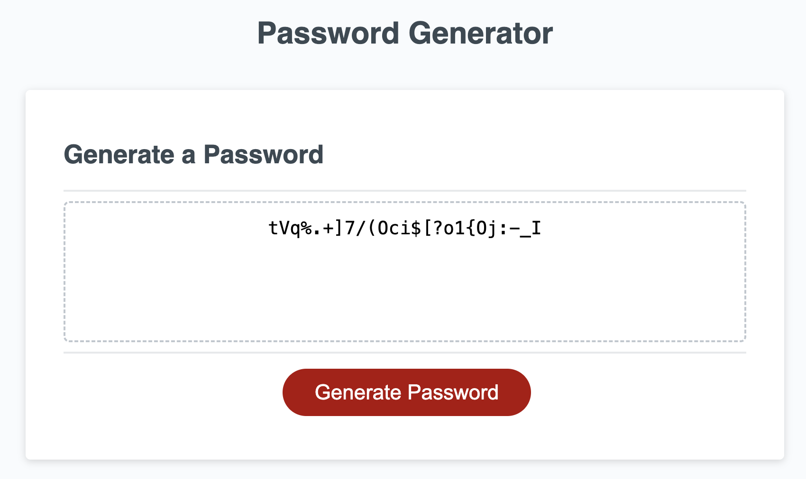

# Password Generator

This JavaScript Password Generator is a customizable tool that enables users to generate passwords by selecting specific character types according to their preferences.

## Features

**Password Length Selection:** Choose the desired length for your password at least 8 characters but no more than 128.

**Character Type Selection:** At least one character type should be selected.
- Lowercase letters (a-z)
- Uppercase letters (A-Z)
- Numbers (0-9)
- Special characters (!, @, #, etc.)

## Technologies Used

- **Frontend:** HTML, CSS and JavaScript
- **Version Control:** Git

## Screenshot

## License

This project is licensed under the [MIT License](LICENSE).